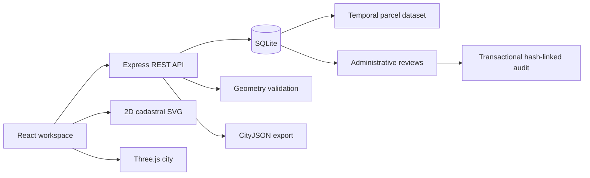

# BhuDrishti 4D — SIH ULPIN

**A virtual city that connects land, vertical property spaces, and their history.**

BhuDrishti demonstrates how a persistent 2D land-parcel identity can anchor versioned 3D property units through occupation, damage, demolition, vacancy, and redevelopment. It combines an interactive city explorer with a searchable registry, spatial validation, administrative reviews, and an auditable change history.

The current dataset contains **36 synthetic parcels and 1,044 spatial units in the 2026 snapshot**, arranged across two demonstration wards and four land-use categories.

> **Release status:** This is a self-hostable synthetic demonstration, not an authoritative government land registry. The parcel IDs, rights holders, surveys, and lifecycle scenarios are synthetic. The proposed 3D identity extension is not official ULPIN issuance. Public website hosting is separate from publishing this GitHub repository.

## Contents

- [Why this project exists](#why-this-project-exists)
- [Features](#features)
- [Quick start](#quick-start)
- [Officer access and configuration](#officer-access-and-configuration)
- [Production build](#production-build)
- [Docker deployment](#docker-deployment)
- [Demo walkthrough](#demo-walkthrough)
- [Architecture](#architecture)
- [Data and identity model](#data-and-identity-model)
- [API reference](#api-reference)
- [Validation and export](#validation-and-export)
- [Testing and CI](#testing-and-ci)
- [Project structure](#project-structure)
- [Persistence and operations](#persistence-and-operations)
- [Troubleshooting](#troubleshooting)
- [Limitations and government beta roadmap](#limitations-and-government-beta-roadmap)

## Why this project exists

A surface parcel can contain apartments, offices, shared spaces, and other independently described volumes. A flat map alone does not show these vertical relationships. Buildings also change over time, while land identity and historical property relationships need to remain traceable.

BhuDrishti separates the persistent parcel from the physical structure and its temporal snapshots. When the demonstration building is cleared, its current geometry disappears from the scene, but its original spatial records remain accessible by returning to the earlier snapshot.

The application supports inspection and administrative review. It does not decide ownership, extinguish rights, or authorize redevelopment.

## Features

| Area | Implemented capability |
| --- | --- |
| Virtual city | Interactive Three.js district with buildings, streets, green spaces, orbit controls, and parcel focus |
| 2D / 3D connection | Cadastral SVG map, 3D view, and linked split view using the same parcel records |
| Property inspection | Floor cutaways, clickable units on the selected floor, area, volume, parent parcel, and version-specific IDs |
| Registry | Search by parcel, building, ward, or spatial identifier; filter by land use |
| Time machine | 2026, 2028, 2029, and 2031 snapshots for the Aranya Heights lifecycle story |
| Validation | Computed rectangular-prism containment, overlap, geometry, duplicate-ID, and review checks |
| Review workflow | Authenticated creation and one-time resolution of persistent administrative reviews |
| Audit | Transactional review events, SHA-256 hash links, integrity verification, and SQL append-only guards |
| Export | CityJSON parcel surfaces and unit solids for a selected year |
| Hosting | Same-origin frontend/API service, non-root Docker image, persistent volume, health check, and CI |

The active city workspace uses locally bundled assets. It does not require a paid map service, satellite imagery credentials, an AI API key, or an external 3D model service.

## Quick start

### Requirements

- **Node.js 22.22.0** is the tested and container-pinned version.
- npm, included with Node.
- Git to clone the repository.
- A modern browser with WebGL support for the 3D view. A 2D fallback is provided if scene rendering fails.
- Docker Engine / Docker Desktop and Docker Compose only if using containers.

The backend uses Node's `node:sqlite` API. An experimental-feature warning on the pinned Node version is expected.

### Install and run

```sh
git clone https://github.com/Arnav2580/SIH_ULPIN.git
cd SIH_ULPIN
npm ci
npm run dev
```

If the repository is private, authenticate with GitHub before cloning.

Open **http://localhost:5173**.

The development command starts:

- Vite frontend on port **5173**.
- Express API on port **4000**.
- A Vite proxy forwarding `/api` requests to the backend.

The first backend start creates and seeds `data/bhudrishti.sqlite`. No separate database server or manual seed command is required. Guest exploration works without credentials.

Stop development processes with **Ctrl+C**.

### Available commands

| Command | Purpose |
| --- | --- |
| `npm ci` | Install the versions recorded in the lockfile |
| `npm run dev` | Start frontend and API with development reload |
| `npm run build` | Type-check frontend/backend and build the frontend into `dist/` |
| `npm start` | Start the API and serve an existing frontend build |
| `npm test` | Run the automated test suite |
| `npm audit --omit=dev` | Check runtime packages against the npm advisory database |

## Officer access and configuration

Guests can inspect the synthetic city, validation results, reviews, and audit trail. Review creation and resolution require the deployment's officer credential.

There is **no default officer token**. If `OFFICER_TOKEN` is unset or empty, all administrative writes are denied.

| Variable | Default | Purpose |
| --- | --- | --- |
| `OFFICER_TOKEN` | Unset | Shared demonstration officer credential |
| `PORT` | `4000` | Backend listening port |
| `DB_PATH` | `data/bhudrishti.sqlite` | Persistent SQLite location |
| `NODE_ENV` | Unset locally | Set to `production` for production logging and security behavior |

For an administrator-led demo, set `OFFICER_TOKEN` through your shell or process manager before starting the server, then enter the same value through **Guest viewer → Officer access** in the application. Use a randomly generated secret, not a reused password.

The browser holds the credential only in React memory. Reloading the page or signing out clears that browser session.

For file-based local configuration:

1. Create a local `.env` from the variable names in [`.env.example`](.env.example).
2. Set a generated `OFFICER_TOKEN`.
3. Run the built application with explicit environment-file loading:

```sh
npm run build
node --env-file=.env --import tsx server/index.ts
```

**`npm start` and `npm run dev` do not automatically load the backend's `.env` file.** Docker Compose does load its project `.env` for variable substitution.

If you change the development backend port, also update the proxy target in [`vite.config.ts`](vite.config.ts).

Keep real personal information out of demo review notes: reviews and audit payloads are readable by guests in this release.

## Production build

```sh
npm ci
npm run build
npm start
```

Open **http://localhost:4000**. Express serves both `dist/` and `/api`, so the production site does not need a running Vite process.

This application requires a running Node server and persistent storage. Uploading only `dist/` to GitHub Pages or another static host will not provide the API or database.

For public hosting, configure HTTPS, a domain, persistent storage, and a reverse proxy. See the [deployment runbook](docs/DEPLOYMENT.md) for operational requirements.

## Docker deployment

```sh
docker compose up --build -d
docker compose logs -f app
```

Open **http://localhost:4000** on the Docker host. For write-enabled demos, configure `OFFICER_TOKEN` in the project `.env` before starting Compose.

The supplied deployment:

- Builds the frontend inside the image.
- Runs the application as the non-root `node` user.
- Stores the database in the `registry-data` named volume.
- Binds port 4000 to host loopback.
- Drops Linux capabilities and disables privilege escalation.
- Checks `/api/health` periodically.
- Restarts unless explicitly stopped.

Stop the service without deleting its persistent volume:

```sh
docker compose stop app
```

Resume it:

```sh
docker compose start app
```

Place an HTTPS reverse proxy in front of the loopback port for a hosted demo. The repository does not provision DNS, certificates, or a cloud account.

## Demo walkthrough

1. Open **City explorer** and switch between **2D**, **3D**, and **Split**.
2. Select a parcel on the map. Both views and the property panel refer to the same record.
3. Select **Aranya Heights / P-9471**, choose Floor 8, and inspect a unit. Use the focus control to bring the parcel closer in 3D.
4. Follow the lifecycle timeline:

   | Year | Demonstrated state |
   | --- | --- |
   | 2026 | Occupied residential tower with 48 units |
   | 2028 | Damaged structure; historical records retained |
   | 2029 | Vacant land; persistent parcel identity remains |
   | 2031 | Replacement commercial structure with 12 units |

5. Validate the 2031 parcel. The application reports three replacement-unit records requiring rights review and identifies the synthetic source provenance.
6. Open **Parcel registry**, search for a parcel or spatial ID, and inspect a result.
7. With officer access, raise a review, resolve it in **Review queue**, and inspect the resulting **Audit trail**.
8. Export the selected year's city geometry.

Most district parcels remain unchanged through time. P-9471 carries the disaster/redevelopment scenario.

See the [five-minute presentation guide](docs/DEMO.md) for a longer walkthrough.

## Architecture



| Layer | Technology |
| --- | --- |
| Frontend | React 19, TypeScript, Vite |
| 3D rendering | Three.js, React Three Fiber, Drei |
| 2D rendering | Interactive SVG using the shared city model |
| UI | CSS, Lucide icons |
| Backend | Express 5, TypeScript, tsx |
| Persistence | SQLite through Node's built-in API |
| Request validation | Zod |
| HTTP protection | Helmet, express-rate-limit |
| Verification | Vitest, Testing Library, Supertest |
| Packaging | Docker, Docker Compose, GitHub Actions |

## Data and identity model

The shared types live in [`shared/city.ts`](shared/city.ts).

- **CityParcel:** persistent land anchor, name, use, ward, rectangular footprint, and versions.
- **CityVersion:** effective year, structure identity, status, floors, units, and source reference.
- **CityUnit:** structure-specific spatial ID, floor, number, volume bounds, area, volume, holder label, and review flag.
- **Review:** administrative observation with pending/resolved status and timestamps.
- **Audit:** event sequence, serialized payload, timestamp, previous hash, and current hash.

Synthetic parcel anchors begin with `DEMO`. Proposed 3D IDs begin with `3D-DEMO` and include the structure version, floor, and unit to avoid reusing a former property's identity after reconstruction.

Coordinates use a **local engineering grid in metres**. Internal geometry uses Y as the vertical axis for the 3D renderer. Export converts the axes to horizontal XY and vertical Z. No surveyed location or EPSG reference is asserted.

Historical snapshots remain present in the stored dataset. Resolving an administrative review does not modify a legal right or its mapping.

## API reference

API requests use JSON. Protected requests require:

```text
Authorization: Bearer <configured-officer-token>
```

| Method | Endpoint | Access | Purpose |
| --- | --- | --- | --- |
| GET | `/api/health` | Guest | Availability and audit integrity |
| GET | `/api/city` | Guest | District dataset and supported years |
| GET | `/api/parcels/:id` | Guest | Parcel and its temporal records |
| POST | `/api/parcels/:id/validate` | Guest | Validate a snapshot using `{"year":2031}` |
| GET | `/api/city/export?year=2026` | Guest | Download city geometry |
| POST | `/api/session` | Officer token | Verify the supplied credential |
| GET | `/api/reviews` | Guest | List synthetic administrative reviews |
| POST | `/api/reviews` | Officer token | Create `{"parcelId":"P-9471","note":"..."}` |
| POST | `/api/reviews/:id/resolve` | Officer token | Resolve a pending review once |
| GET | `/api/audit` | Guest | Audit events and chain verification |

Examples:

```sh
curl http://localhost:4000/api/health

curl -X POST http://localhost:4000/api/parcels/P-9471/validate \
  -H 'Content-Type: application/json' \
  -d '{"year":2031}'

curl 'http://localhost:4000/api/city/export?year=2026' \
  -o city-2026.city.json
```

Supported snapshot years are `2026`, `2028`, `2029`, and `2031`. Review notes must contain 10–2,000 characters. Invalid input returns 400, unauthorized writes return 401, missing parcels return 404, and repeat/invalid review resolution returns 409.

## Validation and export

The active validator examines the stored coordinates for:

- Finite, positive-volume rectangular solids.
- Containment within the parcel and structure envelope.
- Pairwise 3D overlaps, permitting shared faces.
- Duplicate spatial identifiers.
- Unresolved review flags and source provenance.

The displayed score is the percentage of checks that pass. It is not a survey-accuracy score, legal determination, or certification.

CityJSON export contains parcel surfaces and current unit solids, quantized to integer millimetres with a coordinate transform. Full external CityJSON conformance certification is not claimed.

## Testing and CI

```sh
npm test
npm run build
npm audit --omit=dev
```

The current suite includes 11 tests covering:

- Temporal identity and preserved historical units.
- Overlap and containment failures.
- Export coordinate transformation.
- Unauthorized writes and invalid API requests.
- One-time review resolution and linked audit events.
- Database close/reopen persistence.
- React parcel selection, search, lifecycle validation, and officer review workflows against the real Express handlers and SQLite store.

The UI tests replace the WebGL surface. They do not establish rendering quality or GPU/browser compatibility. Native visual verification was blocked by pending computer-use permissions in the development environment.

[GitHub Actions](.github/workflows/ci.yml) installs locked dependencies, runs tests, builds the application, audits runtime dependencies, and builds the Docker image. See [verification notes](docs/VERIFICATION.md) for the evidence and limits.

## Project structure

```text
src/
  App.tsx                    City workspace and application flows
  App.test.tsx               UI → API → SQLite integration tests
  city-api.ts                API client
  components/
    CityMap.tsx              Interactive 2D parcels
    CityScene.tsx            Interactive 3D district and units
    SceneBoundary.tsx        Scene failure fallback
  styles.css                 Responsive interface styling
shared/
  city.ts                    Shared domain types and spatial helpers
server/
  index.ts                   Service startup and graceful shutdown
  app.ts                     HTTP routes, authorization and middleware
  store.ts                   SQLite persistence and audit transactions
  city-data.ts               Synthetic district seed
  city-services.ts           Geometry validation and CityJSON export
  city.test.ts               Backend and geometry tests
docs/
  ARCHITECTURE.md             Data flow and API notes
  DEPLOYMENT.md               Hosting, backup and government beta gates
  DEMO.md                    Presentation walkthrough
  VERIFICATION.md            Tested behavior and known verification gaps
Dockerfile                   Production image
compose.yaml                 Single-node deployment and volume
.env.example                 Configuration names without credentials
.github/workflows/ci.yml      Automated checks
```

The earlier single-parcel prototype remains in `server/data.ts`, `server/services.ts`, `shared/types.ts`, and the older scene/panel components. The current entry points do not use its placeholder validation or export.

## Persistence and operations

The local database defaults to `data/bhudrishti.sqlite`; it and its WAL files are ignored by Git. Docker uses `/app/data/bhudrishti.sqlite` in its named volume.

Review updates and audit events commit in the same transaction. Audit hashes incorporate the action, payload, timestamp, and preceding hash. SQL triggers reject ordinary updates/deletions to audit rows. This provides local tamper evidence, not independent notarization or protection from a privileged database administrator rewriting the entire database.

For filesystem backups, stop the service and snapshot the **entire** data directory or volume before restarting. Copying only the main SQLite file while writes are active can omit WAL data. Restore into an isolated environment and verify health, review counts, and audit integrity.

The current storage adapter supports a **single application instance**. Do not run multiple replicas against the same volume. See the [operations runbook](docs/DEPLOYMENT.md) for backup and rollback guidance.

## Troubleshooting

| Symptom | What to check |
| --- | --- |
| Application cannot load city data | Start both services with `npm run dev`; check `http://localhost:4000/api/health` |
| `node:sqlite` is unavailable | Check `node --version` and use the tested Node 22.22.0 runtime |
| Officer access is rejected | Ensure the backend received a nonempty `OFFICER_TOKEN`; restart after changing it |
| `.env` changes have no effect | Load the file explicitly for Node, export variables, or use Compose |
| Port 4000 is already occupied | Stop the other instance; if changing backend port, update the development proxy |
| Built homepage is missing | Run `npm run build` before `npm start` |
| 3D rendering fails | Check browser WebGL support; use the 2D view/fallback |
| Reviews disappear in a container deployment | Confirm the persistent named volume is attached and was not removed |
| A parcel does not change when changing year | Only P-9471 has multiple lifecycle versions in the current seed |
| Export seems unrelated to a real map | The dataset uses synthetic local coordinates, not surveyed geographic coordinates |

## Limitations and government beta roadmap

The repository provides a working demonstration foundation. Before processing real government data, the project needs:

1. Approved hosting, TLS, identity integration, named users, roles, and MFA.
2. Authoritative ULPIN and survey feeds, coordinate-reference control, and governed ingestion.
3. Formal parties, legal instruments, approvals, and authoritative redevelopment relationships.
4. General polygon/solid topology and appropriate spatial-database support, such as PostGIS.
5. Security assessment, accessibility acceptance, workload testing, recovery rehearsal, and operational ownership.
6. Externally anchored or signed audit evidence where required.

AI footprint extraction, satellite/drone ingestion, BIM import, blockchain consensus, and official government connectors are **not implemented**. The present demo uses seeded data and rectangular volumes.

Detailed next stages are recorded in [PLAN.md](PLAN.md) and the [government beta gates](docs/DEPLOYMENT.md#government-beta-gates-still-open).
